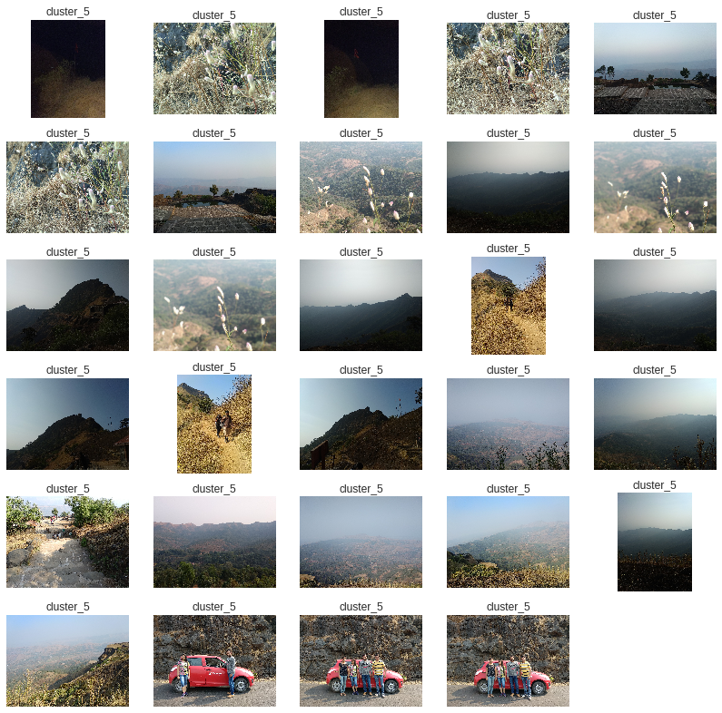
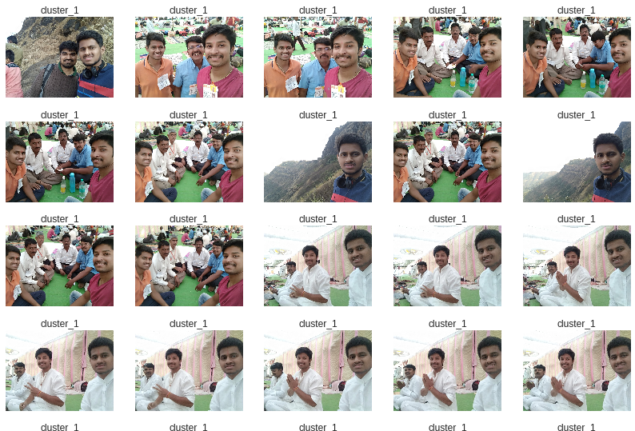
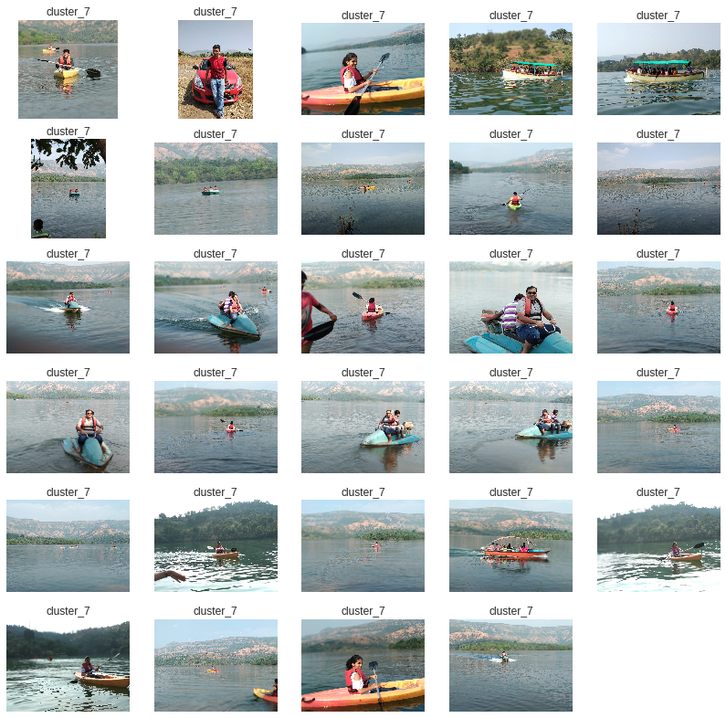

# **Image Clustering Using Convnets Transfer Learning and K-Means++**

### Motivation behind using Convnets Transfer Learning for Image feature Extraction
-  Image Clustering using simple KMeans does'nt yield good results. Simply flattening the image and passing it to KMeans doesn't preseve image features. 
-  Instead, Convolutional Neural Networks preserves important characteristics of an image, as its biologically inspired by the architecture that is present in human/animal brains. 
-  Convolutional Neural Network layers detects pixels, edges, text, parts, objects in the image, thereby preserving all the important features of an image.

### Transfer Learning

-  Core idea is instead of building a Convolutional Neural Network from scratch to solve our task, what if we can reuse existing trained models like VGG16, AlexNet architectures.
-  Keras actually has VGG16 trained on ImageNet dataset, which is the one of the largest object classification dataset.

## Project Description 

-  Input Dataset -> My Google Photos captured on my mobile cam 
-  Output -> Cluster of similar Images 

### Algorithms used 

-  Keras Model of the VGG16 network, trained on Imagenet dataset is used to extract feature vectors of the images.
-  Optimal K for KMeans is determined using Elbow method
-  These feature vectors of images are used to form clusters using KMeans++

### Packages Required

-  Python        Programming language
-  Opencv (cv2)  TO read and write the images
-  Numpy         To perform operations on image arrays
-  Keras         To load the pretrained Imagenet model weights and extract image feature vectors
-  Matplotlib    To plot the image clusters as a graph
-  os            To read and write the files from directories

### Results : Similar Images are clustered together

#### Cluster 5

#### Cluster 1

#### Cluster 7

#### Acknowledgement

-  Inspired from https://github.com/elcorto/imagecluster/tree/master/imagecluster
